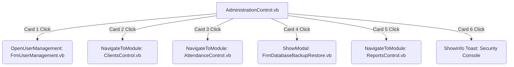
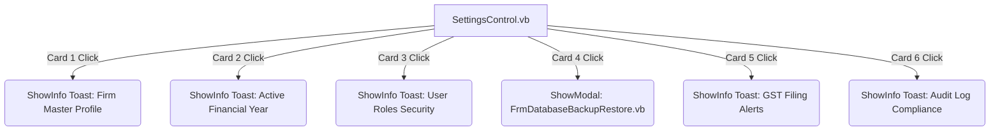
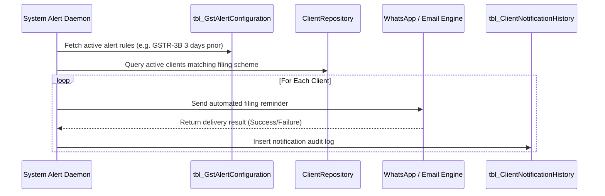
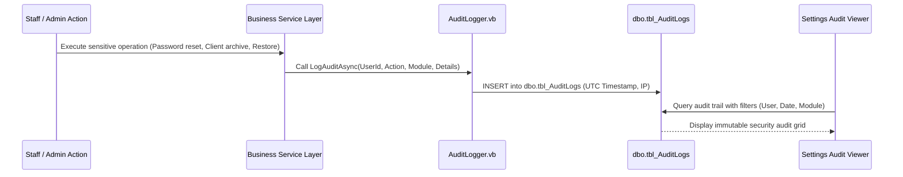

# PHASE 10 — ADMINISTRATION & SETTINGS COMPLETE WORKFLOW ARCHITECTURE AUDIT

> **Project Name**: CA Office Workforce Productivity Automation System  
> **Target Solution**: `e:\Staff automation\StaffAutomation.sln`  
> **Document Status**: Complete Read-Only Architecture Audit  
> **Governance State**: SDD & Build-First Governance Active (Phase 10 Pre-Implementation Phase)  

---

## 1. Executive Summary & Audit Directives

This document presents a comprehensive, read-only architectural audit of the **Administration** and **Settings** modules for the CA Office Workforce Productivity Automation System. All findings are derived directly from the active code base (`StaffAutomation.WinForms`, `StaffAutomation.BLL`, `StaffAutomation.DAL`, `StaffAutomation.Core`) and SQL DDL scripts (`database/scripts/`).

### Audit Directives Compliance
* **Read-Only Inspection**: Zero source code modifications, UI alterations, schema changes, or service logic edits were performed.
* **Empirical Analysis**: All mappings link directly to concrete VB.NET source files, interfaces, SQL tables, and controls.
* **Module Disambiguation**: Clear boundaries have been established between Administration (Operational Supervision & Maintenance) and Settings (System Rules & Global Configurations).

---

## 2. Current Architecture Map

The solution follows a strict 4-tier Clean Architecture pattern. The presentation tier (`StaffAutomation.WinForms`) interacts with core domain abstractions through business services (`StaffAutomation.BLL`), which communicate with data access repositories (`StaffAutomation.DAL`) and entity models (`StaffAutomation.Core`).

```
+-----------------------------------------------------------------------------------+
|                            StaffAutomation.WinForms                               |
|-----------------------------------------------------------------------------------|
|  Main Shell Navigation: FrmMainShell.vb, NavigationService.vb, WorkspaceLoader.vb |
|  Admin Consoles: AdministrationControl.vb, FrmUserManagement.vb,                 |
|                  FrmClientManagement.vb, FrmDatabaseBackupRestore.vb              |
|  Settings Consoles: SettingsControl.vb                                            |
|  Shared UI: AppActionCard.vb, ThemeConstants.vb, FrmInAppAlert.vb                 |
+------------------------------------------+----------------------------------------+
                                           |
                                           v
+-----------------------------------------------------------------------------------+
|                              StaffAutomation.BLL                                  |
|-----------------------------------------------------------------------------------|
|  User & Auth: UserService.vb, AuthService.vb, AuthorizationService.vb             |
|  Client & GST: ClientService.vb, GstVerificationEngine.vb                         |
|  Attendance: AttendanceService.vb, AttendancePolicyEngine.vb                      |
|  Tasks & Performance: TaskManagementService.vb, TaskWorkflowEngine.vb             |
|  Logging & Audit: AppLogger.vb, AuditLogger.vb                                    |
|  Security Policy: PermissionProvider.vb                                           |
+------------------------------------------+----------------------------------------+
                                           |
                                           v
+-----------------------------------------------------------------------------------+
|                              StaffAutomation.DAL                                  |
|-----------------------------------------------------------------------------------|
|  Data Infrastructure: SqlHelper.vb, DbConnectionFactory.vb, AppConfiguration.vb   |
|  Repositories: UserRepository.vb, ClientRepository.vb, AttendanceRepository.vb,   |
|                TaskRepository.vb, TaskActivityRepository.vb, DiscussionRepo.vb   |
|  Disaster Recovery: DatabaseBackupService.vb, DatabaseIntegrityService.vb,        |
|                     DatabaseBackupRetentionService.vb, DatabaseRestoreRunner.vb   |
+------------------------------------------+----------------------------------------+
                                           |
                                           v
+-----------------------------------------------------------------------------------+
|                              StaffAutomation.Core                                 |
|-----------------------------------------------------------------------------------|
|  Domain Entities: UserEntity.vb, ClientEntity.vb, AttendanceEntity.vb, TaskEntity |
|  Data Transfer Objects: UserDto.vb, ClientDto.vb, AttendanceDto.vb, TaskDto.vb    |
|  Enums & Security: UserRole.vb, DepartmentType.vb, CurrentUserContext.vb          |
|  Interfaces: IUserRepository.vb, IClientRepository.vb, IDatabaseBackupService.vb  |
+-----------------------------------------------------------------------------------+
```

---

## 3. Current Database Table Map

The application database `StaffAutomationDb` is currently structured across 21 primary tables and views created via `database/scripts/`:

| Schema & Table Name | Logical Category | Primary Key | Description & Master Status |
| :--- | :--- | :--- | :--- |
| `dbo.tbl_Users` | Level 2 Master | `UserId INT` | System staff accounts, PBKDF2 hash/salt, roles, departments. |
| `dbo.tbl_Roles` | Level 1 Master | `RoleId INT` | Role master lookups (1=Admin, 2=Owner, 3=Employee). |
| `dbo.tbl_Departments` | Level 1 Master | `DepartmentId INT` | CA Firm department classifications (Tax, Audit, Accounting). |
| `dbo.tbl_Clients` | Level 2 Master | `ClientId INT` | Client master registry, GSTIN, PAN, entity legal classification. |
| `dbo.tbl_ClientCategories` | Level 2 Master | `ClientCategoryId INT` | Client legal structure master (Proprietorship, LLP, Pvt Ltd). |
| `dbo.tbl_FinancialYears` | Level 2 Master | `FinancialYearId INT` | Financial Year periods (e.g. FY 2026-27), `IsCurrentFY` flag. |
| `dbo.tbl_TaskCategories` | Level 2 Master | `CategoryId INT` | CA service catalog master (GST Return, Income Tax Audit). |
| `dbo.tbl_TaskStatuses` | Level 1 Master | `StatusId INT` | 11-State task workflow state machine master. |
| `dbo.tbl_TaskPriorities` | Level 1 Master | `PriorityId INT` | Task priority ranks and UI color hex codes. |
| `dbo.tbl_TaskTemplates` | Level 2 Master | `TemplateId INT` | Standardized task checklists and statutory deadline offsets. |
| `dbo.tbl_Tasks` | Level 3 Transaction | `TaskId INT` | Core compliance task records with FKs to Client, FY, Category. |
| `dbo.tbl_TaskActivities` | Level 3 Transaction | `ActivityId INT` | Staff time logs per task with `TimeCategoryId` and durations. |
| `dbo.tbl_TimeCategories` | Level 1 Master | `CategoryId INT` | Time tracking billability classification master. |
| `dbo.tbl_Discussions` | Level 3 Transaction | `DiscussionId INT` | Client communication logs, channels, and outcome tracking. |
| `dbo.tbl_CommunicationTypes` | Level 1 Master | `TypeId INT` | Client communication channels (Call, Email, Meeting). |
| `dbo.tbl_CommunicationOutcomes`| Level 1 Master | `OutcomeId INT` | Discussion outcome master and follow-up flags. |
| `dbo.tbl_Attendance` | Level 3 Transaction | `AttendanceId INT` | Daily staff clock-in/out, lunch breaks, working minutes. |
| `dbo.tbl_Notifications` | Level 3 Transaction | `NotificationId INT` | Internal user notification queue. |
| `dbo.tbl_AuditLogs` | Level 3 Transaction | `AuditId INT` | Security audit trail (UserId, Action, ModuleName, Details, IP). |
| `tbl_DatabaseBackupHistory` | Utility / System | `BackupId GUID` | T-SQL backup audit log, SHA-256 hashes, VERIFYONLY status. |
| `tbl_DatabaseBackupConfiguration`| Utility / System | `ConfigId INT` | Single-row store for primary/secondary backup paths, retention. |
| `tbl_DatabaseIntegrityHistory`| Utility / System | `IntegrityCheckId GUID`| DBCC CHECKDB diagnostic execution results. |

---

## 4. Existing vs. Missing Functionality Matrix

### Administration Module (6 Cards Audit)

| Administration Card | Current UI Implementation | Existing Backing Service / Repo | Current Status & Gaps |
| :--- | :--- | :--- | :--- |
| **1. User Account Management** | `AdministrationControl.vb` -> `FrmUserManagement.vb` | `UserService.vb`, `UserRepository.vb` | **Functional MVP**. Allows User CRUD, CSPRNG temporary password generation, password resets. **Gaps**: Lacks fine-grained permission assignment, role permission mapping UI, and user deactivation filtering. |
| **2. Client Master Registry** | `AdministrationControl.vb` -> `ClientsControl.vb` / `FrmClientManagement.vb` | `ClientService.vb`, `ClientRepository.vb`, `GstVerificationEngine.vb` | **Functional Premium**. Smart GSTIN auto-fetch, PAN parsing, Excel import/export, soft delete. **Gaps**: Lacks client filing frequency history and GST alert rule association. |
| **3. Staff Attendance Supervision** | `AdministrationControl.vb` -> `AttendanceControl.vb` | `AttendanceService.vb`, `AttendancePolicyEngine.vb`, `AttendanceRepository.vb` | **Functional Premium**. Live clocking, break management, Admin attendance correction override. **Gaps**: Attendance policy parameters are hardcoded in engine rather than stored in DB. |
| **4. Database Health & Backups** | `AdministrationControl.vb` -> `FrmDatabaseBackupRestore.vb` | `DatabaseBackupService.vb`, `DatabaseIntegrityService.vb`, `DatabaseRestoreRunner.vb` | **Functional Production**. Full T-SQL backups, SHA-256 tamper checks, DBCC CHECKDB, emergency restore. **Gaps**: Lacks active background timer daemon for scheduled daily backups. |
| **5. Executive Reports & Audit Logs** | `AdministrationControl.vb` -> `ReportsControl.vb` | `TaskManagementService.vb`, `AuditLogger.vb`, `TaskRepository.vb` | **Partial Functional**. Executive KPI previews, task completion grids, Excel export. **Gaps**: `tbl_AuditLogs` viewer grid is completely missing in UI (reports only cover tasks/attendance). |
| **6. Security Access Controls** | `AdministrationControl.vb` -> Toast Notification | `PasswordHasher.vb`, `AuthorizationService.vb` | **Placeholder Card**. Card displays toast notification: *"Security settings are governed by global policies"*. **Gaps**: No UI to configure password complexity, lockout thresholds, or session timeouts. |

### Settings Module (6 Cards Audit)

| Settings Card | Current UI Implementation | Existing Backing Service / Repo | Current Status & Gaps |
| :--- | :--- | :--- | :--- |
| **1. Firm Master Profile** | `SettingsControl.vb` -> Toast Notification | None (`tbl_SystemSettings` key-value pairs) | **Placeholder Card**. Toast notification only. **Gaps**: No `tbl_FirmProfile` table, no DTOs, no form to edit legal name, FRN, GSTIN, letterhead headers. |
| **2. Active Financial Year** | `SettingsControl.vb` -> Toast Notification | `TaskRepository.vb` (queries `tbl_FinancialYears`) | **Placeholder UI Card**. Backend table `tbl_FinancialYears` exists, but Settings card has no UI form. **Gaps**: Cannot switch current FY, create new FYs, or lock closed FYs via UI. |
| **3. User Roles Security** | `SettingsControl.vb` -> Toast Notification | `UserService.vb`, `PermissionProvider.vb` | **Placeholder UI Card**. Duplicate concept of Admin Card 1. **Gaps**: Unhooked UI card. Role-permission dynamic matrix is not stored in DB. |
| **4. SQL Database Backups** | `SettingsControl.vb` -> `FrmDatabaseBackupRestore.vb` | `DatabaseBackupService.vb`, `DatabaseBackupRetentionService.vb` | **Functional Shared Dialog**. Opens `FrmDatabaseBackupRestore.vb` modally. Tab 4 ("Backup Configuration") handles backup settings. |
| **5. GST Tax Filing Alerts** | `SettingsControl.vb` -> Toast Notification | None | **Placeholder Card**. Toast notification only. **Gaps**: No GST alert configuration table, no template engine, no SMS/Email/WhatsApp notification scheduler. |
| **6. Audit Log Compliance** | `SettingsControl.vb` -> Toast Notification | `AuditLogger.vb` (writes to `tbl_AuditLogs`) | **Placeholder UI Card**. Duplicate concept of Admin Card 5. **Gaps**: Writes audit logs to DB, but has no UI viewer or compliance export feature. |

---

## 5. Detailed Card-by-Card Workflow & Component Mapping

### Administration Module Workflows



1. **User Account Management**
   * **UI Implementation**: `src/StaffAutomation.WinForms/Forms/Admin/FrmUserManagement.vb`
   * **Navigation**: Click handler on `cardUsers` checks `AuthorizationService.IsAuthorized(UserRole.Admin)`. If authorized, calls `_mainShellHost.LoadScreen(New FrmUserManagement())` or opens modally.
   * **Forms**: `FrmUserManagement.vb` (Container Form with DataGridView `dgvUsers` and Input Panel).
   * **BLL Service**: `UserService.vb` (`GetAllUsersAsync`, `ChangePasswordAsync`).
   * **Repositories**: `UserRepository.vb` (`GetAllAsync`, `GetByIdAsync`, `AddAsync`, `UpdateAsync`).
   * **Tables**: `dbo.tbl_Users`, `dbo.tbl_Roles`, `dbo.tbl_Departments`.
   * **DTOs / Entities**: `UserDto.vb`, `UserEntity.vb`, `UserRole` (Enum), `DepartmentType` (Enum).
   * **Authorization**: `AuthorizationService.IsAuthorized(UserRole.Admin)` enforced on Form Load and Password Reset.
   * **Audit Logging**: Password changes logged via `AuditLogger.LogAuditAsync`. Form `btnSave` currently bypasses BLL logging when invoking repo directly.

2. **Client Master Registry**
   * **UI Implementation**: `src/StaffAutomation.WinForms/Forms/Main/ClientsControl.vb` and `Forms/Admin/FrmClientManagement.vb`
   * **Navigation**: Click handler on `cardClients` calls `NavigateToModule("Clients")`, loading `ClientsControl.vb` into `pnlWorkspace`.
   * **Forms**: `ClientsControl.vb` (UserControl), `FrmAddEditClient.vb` (Modal Dialog), `FrmImportClients.vb` (Modal Dialog).
   * **BLL Service**: `ClientService.vb` (`GetAllClientsAsync`, `CreateClientAsync`, `UpdateClientAsync`, `SoftDeleteClientAsync`), `GstVerificationEngine.vb`.
   * **Repositories**: `ClientRepository.vb` (`GetAllAsync`, `GetByIdAsync`, `AddAsync`, `UpdateAsync`, `SoftDeleteAsync`).
   * **Tables**: `dbo.tbl_Clients`, `dbo.tbl_ClientCategories`, `dbo.tbl_Departments`.
   * **DTOs / Entities**: `ClientDto.vb`, `ClientEntity.vb`, `GstVerificationResult.vb`.
   * **Authorization**: `AuthorizationService.IsAuthorizedAny(UserRole.Admin, UserRole.Owner)` checked for modification actions.
   * **Audit Logging**: `ClientService` writes `CLIENT_CREATE`, `CLIENT_UPDATE`, and `CLIENT_DELETE` audit events.

3. **Staff Attendance Supervision**
   * **UI Implementation**: `src/StaffAutomation.WinForms/Forms/Main/AttendanceControl.vb`
   * **Navigation**: Click handler on `cardAttendance` calls `NavigateToModule("Attendance")`.
   * **Forms**: `AttendanceControl.vb` (UserControl with regular staff clocking view and Admin Supervision tab).
   * **BLL Service**: `AttendanceService.vb`, `AttendancePolicyEngine.vb`.
   * **Repositories**: `AttendanceRepository.vb`.
   * **Tables**: `dbo.tbl_Attendance`, `dbo.tbl_Users`.
   * **DTOs / Entities**: `AttendanceDto.vb`, `AttendanceEntity.vb`, `AdminAttendanceOverviewDto.vb`, `AttendanceCorrectionDto.vb`.
   * **Authorization**: Admin Supervision tab visible only to `UserRole.Admin` and `UserRole.Owner`. `AdminCorrectAttendanceAsync` enforces `AuthorizeAnyOrThrow`.
   * **Audit Logging**: `AttendanceService` logs all punch events and manual admin corrections to `tbl_AuditLogs`.

4. **Database Health & Backups**
   * **UI Implementation**: `src/StaffAutomation.WinForms/Forms/Admin/FrmDatabaseBackupRestore.vb`
   * **Navigation**: Click handler on `cardDatabase` checks `UserRole.Admin` authorization and opens `FrmDatabaseBackupRestore` modally.
   * **Forms**: `FrmDatabaseBackupRestore.vb` (Form with 4 TabPages: Backups, Integrity, Restore, Settings).
   * **BLL / DAL Services**: `DatabaseBackupService.vb`, `DatabaseIntegrityService.vb`, `DatabaseBackupRetentionService.vb`, `DatabaseRestorePreparationService.vb`, `DatabaseRestoreRunner.vb`, `DatabaseServerCapabilityService.vb`.
   * **Repositories**: Direct T-SQL parameterized execution via `SqlHelper.vb`.
   * **Tables**: `tbl_DatabaseBackupHistory`, `tbl_DatabaseIntegrityHistory`, `tbl_DatabaseBackupConfiguration`.
   * **DTOs / Entities**: `DatabaseBackupHistoryDto`, `DatabaseBackupConfiguration`, `DatabaseIntegrityHistoryDto`.
   * **Authorization**: Checked on Form Load (`IsAuthorized(UserRole.Admin)`), Backup Execution, and Restore Execution.
   * **Audit Logging**: Retention cleanups and database restorations write structured events via `IAuditLogger`.

5. **Executive Reports & Audit Logs**
   * **UI Implementation**: `src/StaffAutomation.WinForms/Forms/Main/ReportsControl.vb`
   * **Navigation**: Click handler on `cardReports` calls `NavigateToModule("Reports")`.
   * **Forms**: `ReportsControl.vb` (UserControl displaying executive metrics, task turnarounds, and Excel export).
   * **BLL Service**: `TaskManagementService.vb`, `NativeExcelEngine.vb`.
   * **Repositories**: `TaskRepository.vb`, `ClientRepository.vb`, `UserRepository.vb`.
   * **Tables**: `dbo.tbl_Tasks`, `dbo.tbl_Attendance`, `dbo.tbl_Clients`, `dbo.tbl_AuditLogs`.
   * **DTOs / Entities**: `DashboardKpiSummaryDto.vb`, `AdminAttendanceOverviewDto.vb`.
   * **Authorization**: Access granted to authenticated staff; export functions restricted as needed.
   * **Audit Logging**: System audit events are recorded in `tbl_AuditLogs`, but UI viewer component is missing.

6. **Security Access Controls**
   * **UI Implementation**: `AdministrationControl.vb` (Card 6)
   * **Navigation**: Click handler invokes `AppNotificationHelper.ShowInfo("Security settings are governed by global policies.")`.
   * **Status**: **Placeholder**. No form or backing service currently created.

---

### Settings Module Workflows



1. **Firm Master Profile**: Placeholder toast. Target: Build `tbl_FirmProfile` and `FrmFirmProfile.vb`.
2. **Active Financial Year**: Placeholder toast. Target: Build `FrmFinancialYearManagement.vb` to manage `tbl_FinancialYears`.
3. **User Roles Security**: Placeholder toast. Target: Link to role permission matrix UI.
4. **SQL Database Backups**: **Functional**. Opens `FrmDatabaseBackupRestore.vb` focusing on Tab 4 ("Backup Configuration").
5. **GST Tax Filing Alerts**: Placeholder toast. Target: Build `tbl_GstAlertConfiguration` and `FrmGstAlertSettings.vb`.
6. **Audit Log Compliance**: Placeholder toast. Target: Build `FrmAuditLogViewer.vb` to query `dbo.tbl_AuditLogs`.

---

## 6. Duplicate Functionality & Module Boundary Analysis

To enforce strict single-responsibility principles across the system, the overlapping responsibilities between Administration and Settings are demarcated as follows:

```
+----------------------------------------------------------------------------------+
|                            MODULE BOUNDARY SEPARATION                            |
+----------------------------------------------------+-----------------------------+
|                ADMINISTRATION CONSOLE              |       SETTINGS CONSOLE      |
|           (Operational Supervision)                |   (Configuration & Rules)   |
+----------------------------------------------------+-----------------------------+
| 👤 User Accounts: Staff account creation,           | 👤 User Security: Password   |
|    department assignment, password resets.         |    complexity policies.     |
|                                                    |                             |
| 💾 Backup Operations: Manual T-SQL backups,         | 💾 Backup Config: Storage   |
|    VERIFYONLY checks, DBCC CHECKDB, restore.       |    paths, retention days.   |
|                                                    |                             |
| 📊 Executive Reports: Business productivity,       | 🔒 Audit Log Viewer: Query  |
|    task turnaround, staff performance.             |    security audit trail.    |
+----------------------------------------------------+-----------------------------+
```

1. **User Accounts (Admin Card 1) vs. User Roles Security (Settings Card 3)**:
   * **Administration**: Owns User Account Lifecycle (Creating users, assigning departments, toggling `IsActive`, triggering temporary password resets).
   * **Settings**: Owns System Security Policies (Password complexity rules, lockouts, session timeouts, role permission matrices).

2. **Database Health (Admin Card 4) vs. SQL Database Backups (Settings Card 4)**:
   * **Administration**: Owns Backup & Recovery Operations (Executing on-demand T-SQL backups, running SHA-256 checksums, executing DBCC CHECKDB diagnostics, performing emergency database restorations).
   * **Settings**: Owns Storage & Retention Configuration (Configuring primary/secondary backup paths, setting retention periods, toggling auto-replication).

3. **Executive Reports (Admin Card 5) vs. Audit Log Compliance (Settings Card 6)**:
   * **Administration**: Owns Business Performance Reporting (Task completion metrics, billable hours, client filing progress, staff productivity exports).
   * **Settings**: Owns Security Compliance & Audit Trail (Querying `dbo.tbl_AuditLogs`, filtering security events, exporting immutable audit trails for compliance).

---

## 7. Database Architecture Audit & Proposed Extensions

### Existing Concept Verification

| Concept | Status in Codebase | Existing Schema / Location | Action Required |
| :--- | :--- | :--- | :--- |
| **Firm Profile** | **MISSING** | Key-value strings in `dbo.tbl_SystemSettings` | Propose `dbo.tbl_FirmProfile` |
| **Financial Years**| **EXISTS** | `dbo.tbl_FinancialYears` (`IsCurrentFY` BIT) | Add audit fields (`ModifiedOn`, `ModifiedBy`, `IsLocked`) |
| **Roles** | **EXISTS** | `dbo.tbl_Roles` (`RoleId`, `RoleName`) | Retain master lookup table |
| **Permissions** | **MISSING** | Hardcoded strings in `PermissionProvider.vb` | Propose `dbo.tbl_Permissions` |
| **Role Permissions**| **MISSING** | None | Propose `dbo.tbl_RolePermissions` |
| **User Permission Overrides** | **MISSING** | None | Propose `dbo.tbl_UserPermissionOverrides` |
| **GST Alert Configuration** | **MISSING** | None | Propose `dbo.tbl_GstAlertConfiguration` |
| **Notification History** | **PARTIAL** | `dbo.tbl_Notifications` (Internal queue) | Propose `dbo.tbl_ClientNotificationHistory` |
| **Audit Log Metadata** | **EXISTS** | `dbo.tbl_AuditLogs` (`UserId`, `Action`, `ModuleName`) | Add extended metadata columns (`EntityName`, `EntityId`) |

---

### Proposed Database Additions (Schema Specification)

#### 1. `dbo.tbl_FirmProfile` (CA Firm Master Profile)
Stores official firm legal identity, FRN, GSTIN, and letterhead header details.

```sql
CREATE TABLE dbo.tbl_FirmProfile (
    FirmId INT IDENTITY(1,1) NOT NULL,
    FirmName NVARCHAR(150) NOT NULL,
    FRN NVARCHAR(30) NOT NULL, -- Firm Registration Number
    PAN NVARCHAR(15) NOT NULL,
    GSTIN NVARCHAR(20) NULL,
    Email NVARCHAR(100) NOT NULL,
    Phone NVARCHAR(20) NOT NULL,
    AddressLine1 NVARCHAR(200) NOT NULL,
    AddressLine2 NVARCHAR(200) NULL,
    City NVARCHAR(100) NOT NULL,
    StateName NVARCHAR(100) NOT NULL,
    Pincode NVARCHAR(10) NOT NULL,
    LogoPath NVARCHAR(500) NULL,
    HeaderFormatJson NVARCHAR(MAX) NULL,
    CreatedOn DATETIME2 NOT NULL CONSTRAINT DF_tbl_FirmProfile_CreatedOn DEFAULT (GETUTCDATE()),
    CreatedBy INT NOT NULL CONSTRAINT DF_tbl_FirmProfile_CreatedBy DEFAULT (1),
    ModifiedOn DATETIME2 NULL,
    ModifiedBy INT NULL,
    CONSTRAINT PK_tbl_FirmProfile PRIMARY KEY CLUSTERED (FirmId ASC),
    CONSTRAINT CK_tbl_FirmProfile_SingleRow CHECK (FirmId = 1)
);
```

#### 2. `dbo.tbl_Permissions` (Centralized System Permissions Catalog)
Stores all granular system permissions across all modules.

```sql
CREATE TABLE dbo.tbl_Permissions (
    PermissionId INT IDENTITY(1,1) NOT NULL,
    PermissionCode NVARCHAR(100) NOT NULL, -- e.g. 'User.Create', 'Client.Archive'
    PermissionName NVARCHAR(150) NOT NULL,
    ModuleName NVARCHAR(50) NOT NULL,
    Description NVARCHAR(250) NULL,
    IsActive BIT NOT NULL CONSTRAINT DF_tbl_Permissions_IsActive DEFAULT (1),
    CreatedOn DATETIME2 NOT NULL CONSTRAINT DF_tbl_Permissions_CreatedOn DEFAULT (GETUTCDATE()),
    CONSTRAINT PK_tbl_Permissions PRIMARY KEY CLUSTERED (PermissionId ASC),
    CONSTRAINT UQ_tbl_Permissions_Code UNIQUE NONCLUSTERED (PermissionCode ASC)
);
```

#### 3. `dbo.tbl_RolePermissions` (Dynamic Role-Permission Mapping)
Maps system roles to specific catalog permissions.

```sql
CREATE TABLE dbo.tbl_RolePermissions (
    RolePermissionId INT IDENTITY(1,1) NOT NULL,
    RoleId INT NOT NULL,
    PermissionId INT NOT NULL,
    GrantedOn DATETIME2 NOT NULL CONSTRAINT DF_tbl_RolePermissions_GrantedOn DEFAULT (GETUTCDATE()),
    GrantedBy INT NOT NULL,
    CONSTRAINT PK_tbl_RolePermissions PRIMARY KEY CLUSTERED (RolePermissionId ASC),
    CONSTRAINT FK_tbl_RolePermissions_Roles FOREIGN KEY (RoleId) REFERENCES dbo.tbl_Roles (RoleId),
    CONSTRAINT FK_tbl_RolePermissions_Permissions FOREIGN KEY (PermissionId) REFERENCES dbo.tbl_Permissions (PermissionId),
    CONSTRAINT UQ_tbl_RolePermissions UNIQUE NONCLUSTERED (RoleId ASC, PermissionId ASC)
);
```

#### 4. `dbo.tbl_UserPermissionOverrides` (User-Level Permission Exceptions)
Allows explicit granting or denying of permissions to specific users regardless of role.

```sql
CREATE TABLE dbo.tbl_UserPermissionOverrides (
    OverrideId INT IDENTITY(1,1) NOT NULL,
    UserId INT NOT NULL,
    PermissionId INT NOT NULL,
    IsGranted BIT NOT NULL, -- 1 = Explicit Grant, 0 = Explicit Deny
    Reason NVARCHAR(250) NULL,
    GrantedOn DATETIME2 NOT NULL CONSTRAINT DF_tbl_UserOverrides_GrantedOn DEFAULT (GETUTCDATE()),
    GrantedBy INT NOT NULL,
    CONSTRAINT PK_tbl_UserPermissionOverrides PRIMARY KEY CLUSTERED (OverrideId ASC),
    CONSTRAINT FK_tbl_UserOverrides_Users FOREIGN KEY (UserId) REFERENCES dbo.tbl_Users (UserId),
    CONSTRAINT FK_tbl_UserOverrides_Permissions FOREIGN KEY (PermissionId) REFERENCES dbo.tbl_Permissions (PermissionId),
    CONSTRAINT UQ_tbl_UserOverrides UNIQUE NONCLUSTERED (UserId ASC, PermissionId ASC)
);
```

#### 5. `dbo.tbl_GstAlertConfiguration` (GST & Tax Filing Alert Rules)
Configures statutory filing deadline alert rules and message templates.

```sql
CREATE TABLE dbo.tbl_GstAlertConfiguration (
    AlertConfigId INT IDENTITY(1,1) NOT NULL,
    FilingType NVARCHAR(50) NOT NULL, -- GSTR1, GSTR3B, TaxAudit, ITR, AdvanceTax
    ReminderDaysBefore INT NOT NULL CONSTRAINT DF_tbl_GstAlert_Days DEFAULT (3),
    EnableSmsAlerts BIT NOT NULL CONSTRAINT DF_tbl_GstAlert_SMS DEFAULT (0),
    EnableEmailAlerts BIT NOT NULL CONSTRAINT DF_tbl_GstAlert_Email DEFAULT (1),
    EnableWhatsappAlerts BIT NOT NULL CONSTRAINT DF_tbl_GstAlert_WA DEFAULT (0),
    SmsTemplate NVARCHAR(500) NULL,
    EmailTemplate NVARCHAR(MAX) NULL,
    WhatsappTemplate NVARCHAR(500) NULL,
    IsActive BIT NOT NULL CONSTRAINT DF_tbl_GstAlert_IsActive DEFAULT (1),
    ModifiedOn DATETIME2 NULL,
    ModifiedBy INT NULL,
    CONSTRAINT PK_tbl_GstAlertConfiguration PRIMARY KEY CLUSTERED (AlertConfigId ASC),
    CONSTRAINT UQ_tbl_GstAlert_FilingType UNIQUE NONCLUSTERED (FilingType ASC)
);
```

#### 6. `dbo.tbl_ClientNotificationHistory` (Client Filing Notification Log)
Tracks outbound SMS/Email/WhatsApp filing alerts sent to clients.

```sql
CREATE TABLE dbo.tbl_ClientNotificationHistory (
    NotificationLogId INT IDENTITY(1,1) NOT NULL,
    ClientId INT NOT NULL,
    FilingType NVARCHAR(50) NOT NULL,
    Channel NVARCHAR(20) NOT NULL, -- EMAIL, SMS, WHATSAPP
    RecipientContact NVARCHAR(150) NOT NULL,
    MessageBody NVARCHAR(MAX) NOT NULL,
    DeliveryStatus NVARCHAR(30) NOT NULL, -- PENDING, SENT, FAILED
    SentTimestamp DATETIME2 NOT NULL CONSTRAINT DF_tbl_ClientNotif_SentOn DEFAULT (GETUTCDATE()),
    ErrorMessage NVARCHAR(MAX) NULL,
    SentByUserId INT NOT NULL,
    CONSTRAINT PK_tbl_ClientNotificationHistory PRIMARY KEY CLUSTERED (NotificationLogId ASC),
    CONSTRAINT FK_tbl_ClientNotif_Clients FOREIGN KEY (ClientId) REFERENCES dbo.tbl_Clients (ClientId),
    CONSTRAINT FK_tbl_ClientNotif_Users FOREIGN KEY (SentByUserId) REFERENCES dbo.tbl_Users (UserId)
);
```

---

## 8. Critical System Lifecycles & Architecture Reviews

### Financial Year Critical Review & Migration Strategy

#### Current Handling Traced:
* **Tasks (`dbo.tbl_Tasks`)**: Contains a mandatory Foreign Key `FinancialYearId INT NOT NULL` referencing `dbo.tbl_FinancialYears`. Resolved at runtime by `TaskRepository.vb` (`GetActiveFinancialYearIdAsync`), which queries `WHERE IsCurrentFY = 1`.
* **Attendance (`dbo.tbl_Attendance`)**: Contains `AttendanceDate DATE`. FY is inferred dynamically via Indian statutory accounting rules (April 1st to March 31st).
* **Reports (`ReportsControl.vb`)**: Applies date range filters. Infers FY dynamically based on selected date bounds.
* **GST Compliance & Clients**: GST returns operate on monthly/quarterly tax periods. FY is inferred dynamically from period dates. Clients are multi-year persistent masters.

#### Findings & Migration-Safe Recommendation:
A formal `FinancialYearId` relationship already cleanly exists on transaction records (`dbo.tbl_Tasks`). To maintain 100% backward compatibility with existing data:
1. **No Schema Breaking**: Retain existing `dbo.tbl_FinancialYears` structure.
2. **Central Financial Year Utility**: Introduce a core domain utility (`FinancialYearUtility.vb` in `StaffAutomation.Core`) to standardize dynamic date-to-FY resolution (`April 1 -> March 31`) across Attendance, Reports, and GST modules.
3. **BLL Service Layer**: Expose `IFinancialYearService` in BLL to allow System Administrators to switch `IsCurrentFY = 1` atomically across the solution without locking active tasks.

---

### Authorization Architecture Review & Permission Catalog

#### Existing Phase 5 Authorization Implementation:
* **Service**: `AuthorizationService.vb` implementing `IAuthorizationService`.
* **Role Verification**: `IsAuthorized(UserRole)` and `IsAuthorizedAny(UserRole())`. If `CurrentUser.Role == UserRole.Admin`, returns `True` automatically.
* **Exceptions**: `AuthorizeOrThrow` throws `SecurityAuthorizationException`.

#### Proposed Granular Permission Catalog (To be backed by `tbl_Permissions`):

```
+-----------------------------------------------------------------------------------+
|                           CENTRALIZED PERMISSION CATALOG                          |
+------------------------------------+----------------------------------------------+
| Module                             | Permission Code & Description                |
+------------------------------------+----------------------------------------------+
| User Account Management            | User.View          - View staff account list |
|                                    | User.Create        - Create new staff user   |
|                                    | User.Edit          - Modify user details     |
|                                    | User.ResetPassword - Reset staff passwords   |
|                                    | User.Deactivate    - Toggle user active state|
+------------------------------------+----------------------------------------------+
| Client Master Registry             | Client.View        - View client directory   |
|                                    | Client.Create      - Register new client     |
|                                    | Client.Edit        - Update client profile   |
|                                    | Client.Archive     - Soft-delete client      |
|                                    | Client.GstVerify   - Fetch live GSTIN data   |
|                                    | Client.ImportExport- Process Excel sheets    |
+------------------------------------+----------------------------------------------+
| Attendance Supervision             | Attendance.Punch   - Clock in/out & breaks   |
|                                    | Attendance.ViewOwn - View personal logs      |
|                                    | Attendance.Supervise- Monitor all staff logs |
|                                    | Attendance.Correct - Admin log override      |
+------------------------------------+----------------------------------------------+
| Disaster Recovery & Backups        | Backup.ViewStatus  - View database health    |
|                                    | Backup.Execute     - Run on-demand backup    |
|                                    | Backup.Verify      - Check SHA-256 / VERIFY  |
|                                    | Backup.CheckDb     - Run DBCC CHECKDB        |
|                                    | Backup.Restore     - Execute DB restoration  |
+------------------------------------+----------------------------------------------+
| System Settings                    | Settings.FirmProfile- Edit firm master profile|
|                                    | Settings.FYManage  - Switch active FY period |
|                                    | Settings.GstAlerts - Configure alert rules   |
|                                    | Settings.AuditView - Query security logs     |
+------------------------------------+----------------------------------------------+
```

---

### GST Alert & Audit Log Lifecycles

#### GST Alert Lifecycle


#### Audit Log Lifecycle


---

## 9. Recommended Implementation Order & Migration Plan

Implementation will proceed in 4 phased modules, requiring separate approval for each stage:

```
+-----------------------------------------------------------------------------------+
|                        PHASE 10 MODULE IMPLEMENTATION ROADMAP                      |
+-----------------------------------------------------------------------------------+
|  MODULE 1: Core Master Settings & Firm Profile                                     |
|  - Execute DDL for tbl_FirmProfile                                                |
|  - Implement FirmProfileDto, FirmProfileEntity, IFirmProfileRepository            |
|  - Create FrmFirmProfile.vb and hook to Settings Card 1                           |
+-----------------------------------------------------------------------------------+
                                         |
                                         v
+-----------------------------------------------------------------------------------+
|  MODULE 2: Financial Year & GST Alert Configuration                                |
|  - Add audit fields to tbl_FinancialYears                                         |
|  - Execute DDL for tbl_GstAlertConfiguration & tbl_ClientNotificationHistory      |
|  - Create FrmFinancialYearManagement.vb and FrmGstAlertSettings.vb                |
|  - Hook to Settings Cards 2 & 5                                                   |
+-----------------------------------------------------------------------------------+
                                         |
                                         v
+-----------------------------------------------------------------------------------+
|  MODULE 3: Security, Roles & Permission Catalog                                   |
|  - Execute DDL for tbl_Permissions, tbl_RolePermissions, tbl_UserOverrides       |
|  - Implement dynamic PermissionProvider backing store                             |
|  - Create FrmRolePermissionMatrix.vb and FrmSecurityPolicy.vb                     |
|  - Hook to Settings Card 3 & Admin Card 6                                         |
+-----------------------------------------------------------------------------------+
                                         |
                                         v
+-----------------------------------------------------------------------------------+
|  MODULE 4: Audit Log Compliance Viewer & Backup Daemon                             |
|  - Create FrmAuditLogViewer.vb and hook to Admin Card 5 & Settings Card 6         |
|  - Implement background backup schedule daemon for DatabaseBackupService          |
|  - Final end-to-end verification and documentation update                         |
+-----------------------------------------------------------------------------------+
```

### Migration Impact Analysis
* **Zero Downtime**: All proposed table additions (`tbl_FirmProfile`, `tbl_Permissions`, etc.) are purely additive.
* **No Breaking Changes**: Existing foreign key relationships on `dbo.tbl_Tasks`, `dbo.tbl_Clients`, and `dbo.tbl_Users` remain 100% untouched.
* **Data Integrity**: Existing financial year records and task assignments are preserved without requiring data conversion scripts.

---

*Audit Complete. Document created in workspace root: `PHASE10_ADMIN_SETTINGS_ARCHITECTURE.md`.*
