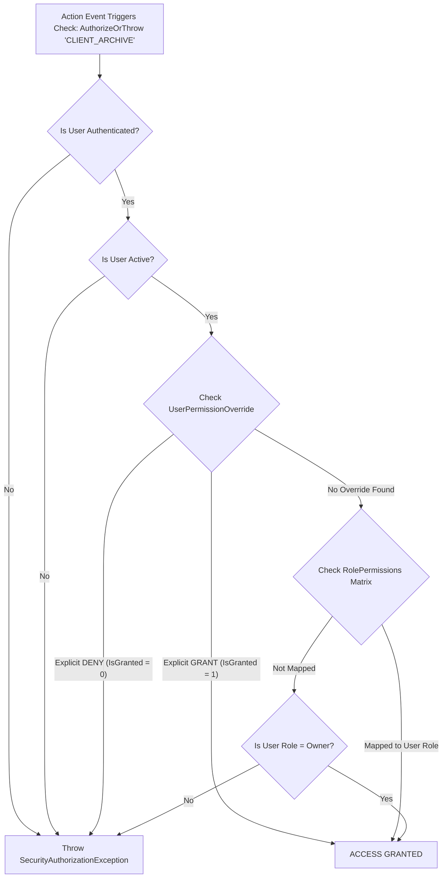

# PHASE 11 — CORE CONFIGURATION & SECURITY FOUNDATION IMPLEMENTATION PLAN

> **Project Name**: CA Office Workforce Productivity Automation System  
> **Solution Path**: `e:\Staff automation\StaffAutomation.sln`  
> **Target Phase**: Phase 11 — Core Configuration & Security Foundation  
> **Status**: Implementation Plan (Pending User Review & Approval)  

---

## 1. Overview & Strategic Directives

Phase 11 establishes the core administrative configuration engines and database-driven access control architecture required by both the **Administration** and **Settings** modules. 

### Key Principles
* **Non-Destructive Extension**: Zero breaking changes to existing Phase 1–10 features (Tasks, Clients, Attendance, Dashboard, Disaster Recovery).
* **Role & Permission Dual-Model**: Existing `UserRole` checks (`Owner`, `Admin`, `Employee`) will remain 100% active while being extended with granular database-driven permission checks.
* **Strict Evaluation Cascade**: Evaluation order: Authentication → Active Status → User Explicit DENY Override → User Explicit GRANT Override → Role Permission Matrix → Owner Superuser Fallback.
* **Idempotent Database Migrations**: Additive T-SQL DDL script (`11_Phase11_Core_Configuration_And_Security_Tables.sql`) preserving all existing tables and data.
* **Auditability & Parameterized SQL**: All sensitive admin/settings mutations will be logged in `dbo.tbl_AuditLogs` via `IAuditLogger`. Zero secrets logged. All SQL parameterized.

---

## 2. Read-Only Analysis Findings

1. **UserRole & Authentication**:
   * Enum `UserRole` in `StaffAutomation.Core.Enums.UserRole` (`Employee = 1`, `Owner = 2`, `Admin = 3`).
   * `CurrentUserContext.vb` tracks active user session thread-safely via `UserDto`.
2. **Authorization Engine**:
   * `IAuthorizationService` & `AuthorizationService.vb` currently perform pure role-level checks.
   * `IPermissionProvider` & `PermissionProvider.vb` contain static hardcoded permission lists.
   * *Resolution*: Extend `IAuthorizationService` to overload `IsAuthorized(permissionCode)` and `AuthorizeOrThrow(permissionCode)`, backed by a database-driven `PermissionService`.
3. **Financial Year (`tbl_FinancialYears`)**:
   * Schema: `FinancialYearId (PK)`, `FYCode`, `StartDate`, `EndDate`, `IsCurrentFY`, `CreatedOn`, `CreatedBy`.
   * Relationships: `dbo.tbl_Tasks.FinancialYearId` has FK constraint `FK_tbl_Tasks_tbl_FinancialYears`.
   * *Resolution*: Alter `tbl_FinancialYears` idempotently to add `IsLocked (BIT DEFAULT 0)`, `IsDeleted (BIT DEFAULT 0)`, `ModifiedOn`, `ModifiedBy`. Do NOT rewrite historical task records.
4. **Settings UI Integration**:
   * `SettingsControl.vb` uses `AppActionCard` components.
   * Card 1 ("Firm Master Profile"), Card 2 ("Active Financial Year"), and Card 3 ("User Roles & Security") currently invoke placeholder toasts.
   * *Resolution*: Bind click handlers to open `FrmFirmProfile.vb`, `FrmFinancialYearManagement.vb`, `FrmRolePermissionManagement.vb`, and `FrmUserPermissionOverrides.vb`.

---

## 3. Database Migration Specification

### Migration Script: `database/scripts/11_Phase11_Core_Configuration_And_Security_Tables.sql`

```sql
-- ===============================================================================
-- Script ID      : 11_Phase11_Core_Configuration_And_Security_Tables.sql
-- Project        : CA Office Workforce Productivity Automation System
-- Target Engine  : SQL Server Express 2016+ / SQL Server 2019+
-- Description    : Additive Idempotent DDL for Firm Profile, Permissions Catalog,
--                  Role Permissions, User Overrides, and Financial Year Lock Columns
-- ===============================================================================

USE [StaffAutomationDb];
GO

-- 1. Alter dbo.tbl_FinancialYears (Add IsLocked, IsDeleted, ModifiedOn, ModifiedBy)
IF NOT EXISTS (SELECT 1 FROM sys.columns WHERE object_id = OBJECT_ID(N'dbo.tbl_FinancialYears') AND name = N'IsLocked')
BEGIN
    ALTER TABLE dbo.tbl_FinancialYears ADD IsLocked BIT NOT NULL CONSTRAINT DF_tbl_FY_IsLocked DEFAULT (0);
END;

IF NOT EXISTS (SELECT 1 FROM sys.columns WHERE object_id = OBJECT_ID(N'dbo.tbl_FinancialYears') AND name = N'IsDeleted')
BEGIN
    ALTER TABLE dbo.tbl_FinancialYears ADD IsDeleted BIT NOT NULL CONSTRAINT DF_tbl_FY_IsDeleted DEFAULT (0);
END;

IF NOT EXISTS (SELECT 1 FROM sys.columns WHERE object_id = OBJECT_ID(N'dbo.tbl_FinancialYears') AND name = N'ModifiedOn')
BEGIN
    ALTER TABLE dbo.tbl_FinancialYears ADD ModifiedOn DATETIME2 NULL;
END;

IF NOT EXISTS (SELECT 1 FROM sys.columns WHERE object_id = OBJECT_ID(N'dbo.tbl_FinancialYears') AND name = N'ModifiedBy')
BEGIN
    ALTER TABLE dbo.tbl_FinancialYears ADD ModifiedBy INT NULL;
END;
GO

-- 2. Create dbo.tbl_FirmProfile (Singleton CA Firm Legal Profile)
IF OBJECT_ID(N'dbo.tbl_FirmProfile', N'U') IS NULL
BEGIN
    CREATE TABLE dbo.tbl_FirmProfile (
        FirmId INT IDENTITY(1,1) NOT NULL,
        FirmName NVARCHAR(150) NOT NULL,
        LegalName NVARCHAR(150) NOT NULL,
        FRN NVARCHAR(30) NOT NULL, -- Firm Registration Number
        PAN NVARCHAR(15) NOT NULL,
        GSTIN NVARCHAR(20) NULL,
        AddressLine1 NVARCHAR(200) NOT NULL,
        AddressLine2 NVARCHAR(200) NULL,
        City NVARCHAR(100) NOT NULL,
        StateName NVARCHAR(100) NOT NULL,
        Pincode NVARCHAR(10) NOT NULL,
        Phone NVARCHAR(20) NOT NULL,
        Email NVARCHAR(100) NOT NULL,
        Website NVARCHAR(150) NULL,
        HeaderFormatJson NVARCHAR(MAX) NULL,
        CreatedOn DATETIME2 NOT NULL CONSTRAINT DF_tbl_FirmProfile_CreatedOn DEFAULT (GETUTCDATE()),
        CreatedBy INT NOT NULL CONSTRAINT DF_tbl_FirmProfile_CreatedBy DEFAULT (1),
        ModifiedOn DATETIME2 NULL,
        ModifiedBy INT NULL,
        CONSTRAINT PK_tbl_FirmProfile PRIMARY KEY CLUSTERED (FirmId ASC),
        CONSTRAINT CK_tbl_FirmProfile_SingleRow CHECK (FirmId = 1)
    );

    -- Seed Default Initial Firm Profile Record
    INSERT INTO dbo.tbl_FirmProfile (FirmName, LegalName, FRN, PAN, GSTIN, AddressLine1, City, StateName, Pincode, Phone, Email, CreatedBy)
    VALUES (N'Demo CA & Associates', N'Demo CA & Associates Chartered Accountants', N'123456W', N'ABCDE1234F', N'27ABCDE1234F1Z5', N'101 Commercial Plaza, MG Road', N'Mumbai', N'Maharashtra', N'400001', N'022-22001122', N'info@democa.com', 1);
END;
GO

-- 3. Create dbo.tbl_Permissions (Centralized Granular Permission Catalog)
IF OBJECT_ID(N'dbo.tbl_Permissions', N'U') IS NULL
BEGIN
    CREATE TABLE dbo.tbl_Permissions (
        PermissionId INT IDENTITY(1,1) NOT NULL,
        PermissionCode NVARCHAR(100) NOT NULL,
        PermissionName NVARCHAR(150) NOT NULL,
        ModuleName NVARCHAR(50) NOT NULL,
        Description NVARCHAR(250) NULL,
        IsActive BIT NOT NULL CONSTRAINT DF_tbl_Permissions_IsActive DEFAULT (1),
        CreatedOn DATETIME2 NOT NULL CONSTRAINT DF_tbl_Permissions_CreatedOn DEFAULT (GETUTCDATE()),
        CONSTRAINT PK_tbl_Permissions PRIMARY KEY CLUSTERED (PermissionId ASC),
        CONSTRAINT UQ_tbl_Permissions_Code UNIQUE NONCLUSTERED (PermissionCode ASC)
    );

    CREATE INDEX IX_tbl_Permissions_Module ON dbo.tbl_Permissions (ModuleName ASC);
END;
GO

-- Seed 25 Core Central Permission Catalog Records
MERGE INTO dbo.tbl_Permissions AS Target
USING (VALUES
    -- USER Management
    (N'USER_VIEW', N'View Staff Accounts', N'User Management', N'Ability to view staff list and profiles'),
    (N'USER_CREATE', N'Create Staff Account', N'User Management', N'Ability to provision new staff user accounts'),
    (N'USER_EDIT', N'Edit Staff Account', N'User Management', N'Ability to update staff profiles and roles'),
    (N'USER_RESET_PASSWORD', N'Reset Staff Password', N'User Management', N'Ability to generate temporary password resets'),
    (N'USER_DEACTIVATE', N'Deactivate Account', N'User Management', N'Ability to disable active staff accounts'),
    
    -- CLIENT Management
    (N'CLIENT_VIEW', N'View Client Registry', N'Client Master', N'Ability to view client master directory'),
    (N'CLIENT_CREATE', N'Create Client Record', N'Client Master', N'Ability to register new clients'),
    (N'CLIENT_EDIT', N'Edit Client Profile', N'Client Master', N'Ability to update client GSTIN, PAN, and details'),
    (N'CLIENT_ARCHIVE', N'Archive Client', N'Client Master', N'Ability to soft-delete/archive client records'),
    
    -- ATTENDANCE Supervision
    (N'ATTENDANCE_VIEW', N'View Attendance Logs', N'Attendance', N'Ability to view staff attendance records'),
    (N'ATTENDANCE_EDIT', N'Edit Attendance Log', N'Attendance', N'Ability to apply manual attendance corrections'),
    (N'ATTENDANCE_APPROVE', N'Approve Corrections', N'Attendance', N'Ability to approve administrative punch overrides'),
    
    -- DATABASE & BACKUP Operations
    (N'BACKUP_VIEW', N'View Backup Health', N'Disaster Recovery', N'Ability to view database backup status & logs'),
    (N'BACKUP_CREATE', N'Execute T-SQL Backup', N'Disaster Recovery', N'Ability to trigger on-demand database backups'),
    (N'BACKUP_RESTORE', N'Execute DB Restore', N'Disaster Recovery', N'Ability to initiate database restorations'),
    (N'BACKUP_CONFIGURE', N'Configure Storage', N'Disaster Recovery', N'Ability to configure paths and retention'),
    
    -- FIRM PROFILE
    (N'FIRM_PROFILE_VIEW', N'View Firm Profile', N'Firm Settings', N'Ability to view firm legal identity details'),
    (N'FIRM_PROFILE_EDIT', N'Edit Firm Profile', N'Firm Settings', N'Ability to update FRN, PAN, GSTIN & letterhead'),
    
    -- FINANCIAL YEAR Management
    (N'FINANCIAL_YEAR_VIEW', N'View Accounting FY', N'Financial Year', N'Ability to view financial year periods'),
    (N'FINANCIAL_YEAR_MANAGE', N'Manage Accounting FY', N'Financial Year', N'Ability to create and activate financial years'),
    (N'FINANCIAL_YEAR_LOCK', N'Lock Completed FY', N'Financial Year', N'Ability to lock completed financial years'),
    
    -- ROLE & SECURITY Management
    (N'ROLE_SECURITY_VIEW', N'View Security Roles', N'Role Security', N'Ability to view role permission matrix'),
    (N'ROLE_SECURITY_MANAGE', N'Manage Role Permissions', N'Role Security', N'Ability to assign permissions to roles'),
    
    -- AUDIT LOG Compliance
    (N'AUDIT_LOG_VIEW', N'View Audit Logs', N'Compliance Audit', N'Ability to query system security audit trail'),
    (N'AUDIT_LOG_EXPORT', N'Export Audit Logs', N'Compliance Audit', N'Ability to export tamper-proof audit trails')
) AS Source (PermissionCode, PermissionName, ModuleName, Description)
ON Target.PermissionCode = Source.PermissionCode
WHEN NOT MATCHED THEN
    INSERT (PermissionCode, PermissionName, ModuleName, Description)
    VALUES (Source.PermissionCode, Source.PermissionName, Source.ModuleName, Source.Description);
GO

-- 4. Create dbo.tbl_RolePermissions (Role-Permission Matrix)
IF OBJECT_ID(N'dbo.tbl_RolePermissions', N'U') IS NULL
BEGIN
    CREATE TABLE dbo.tbl_RolePermissions (
        RolePermissionId INT IDENTITY(1,1) NOT NULL,
        RoleId INT NOT NULL,
        PermissionId INT NOT NULL,
        GrantedOn DATETIME2 NOT NULL CONSTRAINT DF_tbl_RolePermissions_GrantedOn DEFAULT (GETUTCDATE()),
        GrantedBy INT NOT NULL CONSTRAINT DF_tbl_RolePermissions_GrantedBy DEFAULT (1),
        CONSTRAINT PK_tbl_RolePermissions PRIMARY KEY CLUSTERED (RolePermissionId ASC),
        CONSTRAINT FK_tbl_RolePermissions_Roles FOREIGN KEY (RoleId) REFERENCES dbo.tbl_Roles (RoleId),
        CONSTRAINT FK_tbl_RolePermissions_Permissions FOREIGN KEY (PermissionId) REFERENCES dbo.tbl_Permissions (PermissionId),
        CONSTRAINT UQ_tbl_RolePermissions UNIQUE NONCLUSTERED (RoleId ASC, PermissionId ASC)
    );

    CREATE INDEX IX_tbl_RolePermissions_Lookup ON dbo.tbl_RolePermissions (RoleId ASC, PermissionId ASC);
END;
GO

-- Seed Default Admin Role Permissions (RoleId = 3 gets all permissions)
INSERT INTO dbo.tbl_RolePermissions (RoleId, PermissionId, GrantedBy)
SELECT 3, PermissionId, 1
FROM dbo.tbl_Permissions
WHERE NOT EXISTS (
    SELECT 1 FROM dbo.tbl_RolePermissions WHERE RoleId = 3 AND PermissionId = tbl_Permissions.PermissionId
);
GO

-- 5. Create dbo.tbl_UserPermissionOverrides (User Permission Overrides)
IF OBJECT_ID(N'dbo.tbl_UserPermissionOverrides', N'U') IS NULL
BEGIN
    CREATE TABLE dbo.tbl_UserPermissionOverrides (
        OverrideId INT IDENTITY(1,1) NOT NULL,
        UserId INT NOT NULL,
        PermissionId INT NOT NULL,
        IsGranted BIT NOT NULL, -- 1 = Explicit Grant, 0 = Explicit Deny
        Reason NVARCHAR(250) NULL,
        GrantedOn DATETIME2 NOT NULL CONSTRAINT DF_tbl_UserOverrides_GrantedOn DEFAULT (GETUTCDATE()),
        GrantedBy INT NOT NULL CONSTRAINT DF_tbl_UserOverrides_GrantedBy DEFAULT (1),
        CONSTRAINT PK_tbl_UserPermissionOverrides PRIMARY KEY CLUSTERED (OverrideId ASC),
        CONSTRAINT FK_tbl_UserOverrides_Users FOREIGN KEY (UserId) REFERENCES dbo.tbl_Users (UserId),
        CONSTRAINT FK_tbl_UserOverrides_Permissions FOREIGN KEY (PermissionId) REFERENCES dbo.tbl_Permissions (PermissionId),
        CONSTRAINT UQ_tbl_UserOverrides UNIQUE NONCLUSTERED (UserId ASC, PermissionId ASC)
    );

    CREATE INDEX IX_tbl_UserOverrides_Lookup ON dbo.tbl_UserPermissionOverrides (UserId ASC, PermissionId ASC);
END;
GO
```

---

## 4. Database Dependency Diagram

```
                             +------------------------+
                             |    dbo.tbl_Roles       |
                             +-----------+------------+
                                         | 1
                                         |
                                         | N
+-----------------------+    +-----------v------------+    +-----------------------+
|  dbo.tbl_Permissions  <----+ dbo.tbl_RolePermissions +---->     dbo.tbl_Users     |
+-----------+-----------+ PK | (RoleId, PermissionId) | PK +-----------+-----------+
            | 1              +------------------------+                | 1
            |                                                          |
            | N                                                        | N
+-----------v-----------------------+                      +-----------v-----------+
| dbo.tbl_UserPermissionOverrides   |                      |     dbo.tbl_Tasks     |
| (UserId, PermissionId, IsGranted) |                      +-----------+-----------+
+-----------------------------------+                                  | N
                                                                       |
                                                           +-----------v-----------+
                                                           | dbo.tbl_FinancialYears|
                                                           +-----------------------+
```

---

## 5. File-by-File Change Specification

### Files to Create (NEW)

#### A. Core Layer (`StaffAutomation.Core`)
1. `src/StaffAutomation.Core/Entities/FirmProfileEntity.vb`
   * Primary model matching `dbo.tbl_FirmProfile`.
2. `src/StaffAutomation.Core/Entities/FinancialYearEntity.vb`
   * Extended domain entity matching `dbo.tbl_FinancialYears` including `IsLocked`, `IsDeleted`.
3. `src/StaffAutomation.Core/Entities/PermissionEntity.vb`
   * Entity model for `dbo.tbl_Permissions`.
4. `src/StaffAutomation.Core/Entities/RolePermissionEntity.vb`
   * Entity model for `dbo.tbl_RolePermissions`.
5. `src/StaffAutomation.Core/Entities/UserPermissionOverrideEntity.vb`
   * Entity model for `dbo.tbl_UserPermissionOverrides`.
6. `src/StaffAutomation.Core/DTOs/FirmProfileDto.vb`
   * DTO for Firm Profile details.
7. `src/StaffAutomation.Core/DTOs/FinancialYearDto.vb`
   * DTO for Financial Year periods and lock states.
8. `src/StaffAutomation.Core/DTOs/PermissionDto.vb`
   * DTO for permission catalog entries.
9. `src/StaffAutomation.Core/DTOs/UserPermissionOverrideDto.vb`
   * DTO for user-level explicit grants/denies.
10. `src/StaffAutomation.Core/Interfaces/IFirmProfileService.vb`
    * Contract: `GetFirmProfileAsync()`, `SaveFirmProfileAsync(dto, modifiedBy)`.
11. `src/StaffAutomation.Core/Interfaces/IFinancialYearService.vb`
    * Contract: `GetAllAsync()`, `GetActiveAsync()`, `CreateAsync(dto)`, `ActivateAsync(fyId, modifiedBy)`, `LockAsync(fyId, modifiedBy)`.
12. `src/StaffAutomation.Core/Interfaces/IPermissionService.vb`
    * Contract: `GetAllPermissionsAsync()`, `GetPermissionByCodeAsync(code)`.
13. `src/StaffAutomation.Core/Interfaces/IRolePermissionService.vb`
    * Contract: `GetPermissionsForRoleAsync(roleId)`, `UpdateRolePermissionsAsync(roleId, permissionIds, modifiedBy)`.
14. `src/StaffAutomation.Core/Interfaces/IUserPermissionOverrideService.vb`
    * Contract: `GetOverridesForUserAsync(userId)`, `SetOverrideAsync(userId, permissionId, isGranted, reason, modifiedBy)`, `RemoveOverrideAsync(userId, permissionId)`.

#### B. Data Access Layer (`StaffAutomation.DAL`)
15. `src/StaffAutomation.DAL/Interfaces/IFirmProfileRepository.vb`
16. `src/StaffAutomation.DAL/Interfaces/IFinancialYearRepository.vb`
17. `src/StaffAutomation.DAL/Interfaces/IPermissionRepository.vb`
18. `src/StaffAutomation.DAL/Interfaces/IRolePermissionRepository.vb`
19. `src/StaffAutomation.DAL/Interfaces/IUserPermissionOverrideRepository.vb`
20. `src/StaffAutomation.DAL/Repositories/FirmProfileRepository.vb`
    * Parameterized T-SQL repository for `tbl_FirmProfile`.
21. `src/StaffAutomation.DAL/Repositories/FinancialYearRepository.vb`
    * Parameterized T-SQL repository for `tbl_FinancialYears`.
22. `src/StaffAutomation.DAL/Repositories/PermissionRepository.vb`
    * Parameterized T-SQL repository for `tbl_Permissions`.
23. `src/StaffAutomation.DAL/Repositories/RolePermissionRepository.vb`
    * Parameterized T-SQL repository for `tbl_RolePermissions`.
24. `src/StaffAutomation.DAL/Repositories/UserPermissionOverrideRepository.vb`
    * Parameterized T-SQL repository for `tbl_UserPermissionOverrides`.

#### C. Business Logic Layer (`StaffAutomation.BLL`)
25. `src/StaffAutomation.BLL/Services/FirmProfileService.vb`
    * Business rules and audit logging for Firm Profile updates.
26. `src/StaffAutomation.BLL/Services/FinancialYearService.vb`
    * Start/End date validation, overlap checks, single active FY activation, FY locking.
27. `src/StaffAutomation.BLL/Services/PermissionService.vb`
    * Catalog caching & lookups.
28. `src/StaffAutomation.BLL/Services/RolePermissionService.vb`
    * Matrix assignment and audit logging.
29. `src/StaffAutomation.BLL/Services/UserPermissionOverrideService.vb`
    * Explicit grant/deny overrides management and audit logging.

#### D. Presentation Layer (`StaffAutomation.WinForms`)
30. `src/StaffAutomation.WinForms/Forms/Settings/FrmFirmProfile.vb`
    * Modern Krypton dialog to edit Firm Name, FRN, PAN, GSTIN, Address, Contact details.
31. `src/StaffAutomation.WinForms/Forms/Settings/FrmFinancialYearManagement.vb`
    * DataGrid of Financial Years, status indicators (Active/Locked), [+ Create FY] button, [Set Active] & [Lock FY] actions.
32. `src/StaffAutomation.WinForms/Forms/Settings/FrmRolePermissionManagement.vb`
    * Role Selector (Owner / Admin / Employee), Module-Grouped CheckBox list of permissions, [Save Matrix] action.
33. `src/StaffAutomation.WinForms/Forms/Settings/FrmUserPermissionOverrides.vb`
    * User Selector, Permission Grid with Default / Explicit Grant / Explicit Deny, Reason input, Save action.

---

### Files to Modify (EXISTING)

1. `src/StaffAutomation.Core/Security/IAuthorizationService.vb`
   * **Lines 7–12**: Add overloaded method signatures for permission code authorization:
     ```vb
     Function IsAuthorized(permissionCode As String) As Boolean
     Sub AuthorizeOrThrow(permissionCode As String)
     ```
2. `src/StaffAutomation.BLL/Security/AuthorizationService.vb`
   * **Lines 9–37**: Implement permission-code authorization using the strict evaluation cascade:
     1. Authenticated check (`CurrentUserContext.IsAuthenticated`).
     2. Active user check (`CurrentUserContext.CurrentUser.IsActive`).
     3. Check User Explicit DENY override → Return `False`.
     4. Check User Explicit GRANT override → Return `True`.
     5. Check Role Permission matrix → Return `True` if granted.
     6. Owner superuser check → Return `True` if `CurrentUserContext.CurrentUser.Role = UserRole.Owner`.
     7. Default → Return `False`.
3. `src/StaffAutomation.WinForms/Forms/Main/SettingsControl.vb`
   * **Lines 52–65**: Wire click handlers for Card 1 (Firm Profile), Card 2 (Financial Year), and Card 3 (User Roles & Security) to instantiate and display `FrmFirmProfile`, `FrmFinancialYearManagement`, and `FrmRolePermissionManagement`.
4. `src/StaffAutomation.WinForms/Forms/Admin/AdministrationControl.vb`
   * **Lines 84–86**: Wire Card 6 ("Security & Access Controls") to open `FrmUserPermissionOverrides.vb`.

---

## 6. Detailed Authorization Pipeline Architecture



---

## 7. Financial Year Management Rules & Controls

1. **Validation Engine**:
   * `StartDate` must be strictly earlier than `EndDate`.
   * Default Indian FY alignment helper: `1 April [YYYY]` to `31 March [YYYY+1]`.
   * Date range must NOT overlap with any existing non-deleted financial year in `dbo.tbl_FinancialYears`.
2. **Single Active Financial Year Rule**:
   * Activating a financial year executes an atomic transaction setting `IsCurrentFY = 0` for all rows, then `IsCurrentFY = 1` for the target `FinancialYearId`.
3. **Locking Rules**:
   * Locking an FY sets `IsLocked = 1`.
   * Locked financial years cannot be modified, deleted, or un-activated.
   * `dbo.tbl_Tasks` referencing a locked FY block creation/modification of tasks in that FY.
4. **Historical Record Preservation**:
   * Existing `dbo.tbl_Tasks.FinancialYearId` FK records are NEVER modified or re-written automatically during FY creation or switching.

---

## 8. Compatibility & Risk Mitigation

| Risk Area | Severity | Mitigation Strategy |
| :--- | :--- | :--- |
| **Breaking Existing `IsAuthorized(UserRole)` Calls** | High | Overload method signatures in `IAuthorizationService` and `AuthorizationService`. Retain existing role checks 100% intact. |
| **Database Schema Corruption** | Critical | Use `IF NOT EXISTS` guards on all DDL statements in `11_Phase11_Core_Configuration_And_Security_Tables.sql`. No `DROP TABLE` statements. |
| **Task Repository FY Dependency** | Medium | Retain existing `dbo.tbl_FinancialYears` primary key `FinancialYearId`. Add columns without modifying existing column names (`FYCode`, `IsCurrentFY`). |
| **Performance Overhead on Auth Checks** | Medium | Cache user permissions in memory or execute indexed T-SQL lookups (`IX_tbl_RolePermissions_Lookup`, `IX_tbl_UserOverrides_Lookup`). |

---

## 9. Verification & Test Plan

1. **Automated Unit & Integration Tests**:
   * Permission cascade evaluation tests (Explicit Deny overriding Role Grant, Owner superuser, Unauthenticated rejection).
   * Financial Year date range overlap validation tests.
   * Singleton Firm Profile constraint validation.
2. **Manual UI Verification**:
   * Click Settings Card 1 → Verify `FrmFirmProfile` opens, displays seeded firm info, updates DB, and logs audit entry.
   * Click Settings Card 2 → Verify `FrmFinancialYearManagement` displays active FY, allows creating FY 2027-28, prevents overlapping dates, activates FY.
   * Click Settings Card 3 → Verify `FrmRolePermissionManagement` displays permission matrix per role and saves updates.
   * Click Admin Card 6 → Verify `FrmUserPermissionOverrides` allows setting explicit DENY for an Admin on `CLIENT_ARCHIVE` and verifies action is blocked.

---

*End of Implementation Plan. Awaiting User Review & Approval before starting execution.*
