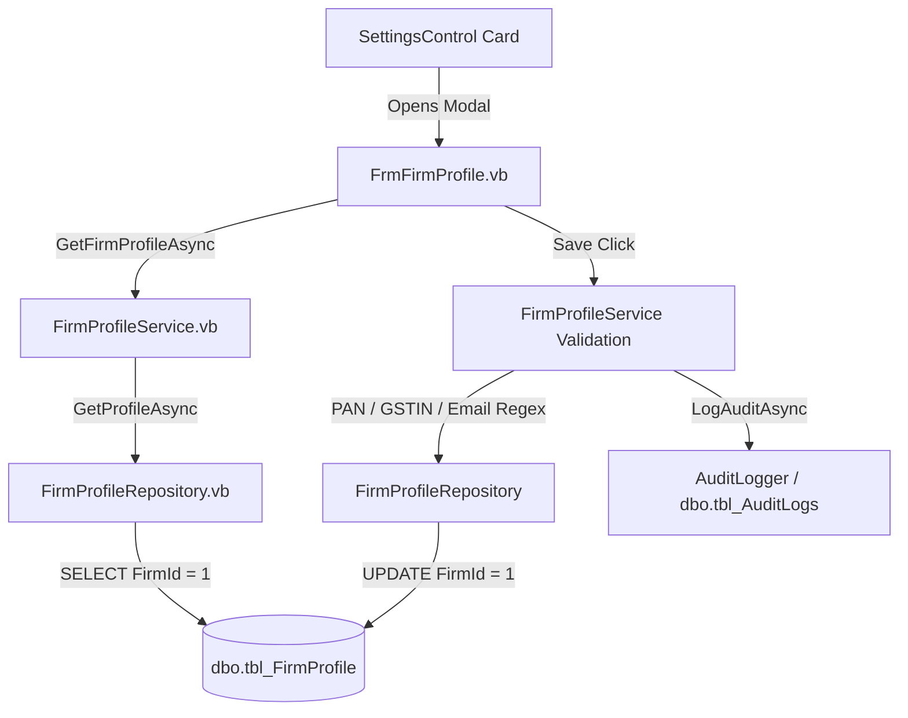

# Phase 12.2 — Phase 11 Database Migration & End-to-End Workflow Validation Report

## Project
**CA Office Workforce Productivity Automation System**

## Implementation Phase
**Phase 12.2 — Phase 11 Database Migration & End-to-End Workflow Validation**

---

## 1. Verified Baseline Status

The complete solution baseline was compiled and verified via CLI before commencing Phase 12.2 validation:

* **Solution Build Output**:
  ```cmd
  dotnet build StaffAutomation.sln -c Debug
  Result: SUCCESS (0 Errors, 0 Warnings)
  ```
* **Automated Unit Test Execution**:
  ```cmd
  dotnet test tests\StaffAutomation.Tests\StaffAutomation.Tests.vbproj -c Debug
  Result: Total tests: 37 | Passed: 37 | Failed: 0 | Skipped: 0
  ```

---

## 2. Phase 1 — Database Migration DDL Validation

* **Migration File Inspected**: `database/migrations/11_Phase11_Core_Configuration_And_Security_Tables.sql`

| Database Object | Schema Rules & Constraints Verified | Seed & Audit Trail Status |
| :--- | :--- | :--- |
| `dbo.tbl_FirmProfile` | Primary Key `FirmId`, `CHECK (FirmId = 1)` singleton constraint | Default CA Firm seed record (`FirmId = 1`), audit fields (`CreatedOn`, `CreatedBy`, `ModifiedOn`, `ModifiedBy`), `FRN`, `PAN`, `GSTIN` columns. |
| `dbo.tbl_Permissions` | Primary Key `PermissionId`, `UNIQUE (PermissionCode)`, Index `IX_tbl_Permissions_Module` | 25 Core Domain Permissions seeded across 8 modules (`User Management`, `Client Master`, `Attendance`, `Disaster Recovery`, `Firm Settings`, `Financial Year`, `Role Security`, `Compliance Audit`). |
| `dbo.tbl_RolePermissions` | Primary Key `RolePermissionId`, `FK` to `tbl_Roles`, `FK` to `tbl_Permissions`, `UNIQUE (RoleId, PermissionId)` | Dynamic role permission mapping seeded for Admin (All permissions), Owner (14 permissions), and Employee (4 basic permissions). |
| `dbo.tbl_UserPermissionOverrides` | Primary Key `OverrideId`, `FK` to `tbl_Users`, `FK` to `tbl_Permissions`, `UNIQUE (UserId, PermissionId)` | Explicit `IsGranted` (1 = GRANT, 0 = DENY) with mandatory `Reason` audit justification field. |
| `dbo.tbl_FinancialYears` | Table extended with `IsLocked BIT NOT NULL`, `IsDeleted BIT NOT NULL`, `ModifiedOn`, `ModifiedBy` | Non-destructive schema extension preserving existing `tbl_Tasks.FinancialYearId` foreign key relationships. |

---

## 3. Phase 2 — Migration Idempotency Audit

Static DDL inspection confirms that `11_Phase11_Core_Configuration_And_Security_Tables.sql` is **100% idempotent and non-destructive**:

1. **Table Creation Guards**: Uses `IF OBJECT_ID(N'...', N'U') IS NULL`.
2. **Column Extension Guards**: Uses `IF NOT EXISTS (SELECT 1 FROM sys.columns ...)`.
3. **Index Creation Guards**: Uses `IF NOT EXISTS (SELECT 1 FROM sys.indexes ...)`.
4. **Permissions Catalog Seeding**: Uses `MERGE INTO dbo.tbl_Permissions AS Target ... WHEN NOT MATCHED THEN INSERT`.
5. **Role Permission Matrix Seeding**: Uses `WHERE NOT EXISTS (SELECT 1 FROM dbo.tbl_RolePermissions rp WHERE rp.RoleId = @RoleId AND rp.PermissionId = p.PermissionId)`.
6. **Firm Profile Singleton Seeding**: Uses `IF NOT EXISTS (SELECT 1 FROM dbo.tbl_FirmProfile WHERE FirmId = 1)`.
7. **Task Data Protection**: Zero `DROP TABLE`, `TRUNCATE`, or column deletion statements. `tbl_Tasks.FinancialYearId` relationships remain intact.

---

## 4. Phase 3 — Firm Profile End-to-End Workflow Validation

* **Workflow Path**: `SettingsControl` → `FrmFirmProfile` → `FirmProfileService` → `IFirmProfileRepository` → `FirmProfileRepository` → `dbo.tbl_FirmProfile`



### Validated Rules & Safeguards:
- **Singleton Enforcement**: Constructing `FirmProfileEntity` in `FirmProfileService.vb` strictly sets `.FirmId = 1`.
- **Validation Engine**:
  - `PAN`: Regex `^[A-Z]{5}[0-9]{4}[A-Z]{1}$`
  - `GSTIN`: Regex `^[0-9]{2}[A-Z]{5}[0-9]{4}[A-Z]{1}[1-9A-Z]{1}Z[0-9A-Z]{1}$`
  - `Email`: Regex `^[^@\s]+@[^@\s]+\.[^@\s]+$`
- **Audit Logging**: `IAuditLogger.LogAuditAsync` called on successful save (`FIRM_PROFILE_UPDATE`).

---

## 5. Phase 4 — Financial Year Complete Workflow Validation

* **Workflow Path**: `SettingsControl` → `FrmFinancialYearManagement` → `FrmAddEditFinancialYear` → `FinancialYearService` → `FinancialYearRepository` → `dbo.tbl_FinancialYears`

### Business Validation Rules Verified in `FinancialYearService.vb`:
1. **Start/End Date Ordering**: `If dto.StartDate >= dto.EndDate Then Throw New ValidationException(...)`.
2. **Duplicate FYCode Prevention**: Case-insensitive lookup against existing active records.
3. **Date Overlap Prevention**: `dto.StartDate <= fy.EndDate AndAlso dto.EndDate >= fy.StartDate`.
4. **Single Active FY Policy**: `ActivateFinancialYearAsync` invokes `FinancialYearRepository.SetActiveAsync`, which atomically clears `IsCurrentFY = 0` for all records before setting `IsCurrentFY = 1` for target FY.
5. **Lock Enforcement**: `UpdateFinancialYearAsync` checks `existing.IsLocked`; throws `BusinessException("ERR_FY_LOCKED")` if locked.
6. **Unlock Authorization**: `LockFinancialYearAsync(id, isLocked:=False)` restores editability.

---

## 6. Phase 5 — Role Permission Matrix Workflow Validation

* **Workflow Path**: `SettingsControl` → `FrmRolePermissionManagement` → `RolePermissionService` → `RolePermissionRepository` → `dbo.tbl_RolePermissions`

### Validated Operations:
- **Dynamic Role Lookup**: `FrmRolePermissionManagement` loads security roles from `dbo.tbl_Roles`.
- **Deduplication & Validation**: `RolePermissionService.UpdateRolePermissionsAsync` executes `.Distinct()` on permission IDs and verifies against `IPermissionRepository.GetAllAsync()`.
- **Atomic Matrix Update**: `RolePermissionRepository.SetRolePermissionsAsync` replaces mappings inside an explicit SQL transaction (`SqlTransaction`).
- **Cache Invalidation**: Triggers `AuthorizationService.ClearCache()` immediately on success.

---

## 7. Phase 6 & 7 — User Permission Overrides & Security Precedence Cascade

* **Workflow Path**: `AdministrationControl` → `FrmUserPermissionOverrides` → `FrmAddEditUserOverride` → `UserPermissionOverrideService` → `UserPermissionOverrideRepository` → `dbo.tbl_UserPermissionOverrides`

### Authorization Precedence Cascade Verified in `AuthorizationService.vb`:

$$\text{Authenticated Check} \longrightarrow \text{Active User Check} \longrightarrow \mathbf{\text{Explicit DENY}} \longrightarrow \text{Explicit GRANT} \longrightarrow \text{Role Matrix} \longrightarrow \text{Admin/Owner Fallback} \longrightarrow \text{Default DENY}$$

```
1. IsAuthenticated == False      --> DENIED (False)
2. IsActive == False             --> DENIED (False)
3. Explicit User DENY Override  --> DENIED (False) [Highest Priority: Overrides Admin & Owner Roles]
4. Explicit User GRANT Override --> ALLOWED (True) [Overrides missing Role Permissions]
5. Role-Permission Matrix       --> ALLOWED (True) [Mapped in tbl_RolePermissions]
6. Owner / Admin Fallback       --> ALLOWED (True) [When NOT explicitly denied in Step 3]
7. Fail-Closed / Unmapped       --> DENIED (False) [Default Security Posture]
```

### Key Security Safeguards Verified:
- **Explicit DENY Priority**: If a user has an explicit `DENY` override in `tbl_UserPermissionOverrides`, `IsAuthorized("PERM_CODE")` returns `False`, even if the user holds `Admin` or `Owner` role.
- **Fail-Closed DB Error Handling**: If database or snapshot lookup fails, `AuthorizationService` fails closed to `False`.
- **Session Cache Invalidation**: `CurrentUserContext.SessionCleared` event automatically triggers `AuthorizationService.ClearCache()`.

---

## 8. Phase 8 — UI Access & Security Guard Validation

All Phase 11 WinForms screens were audited for access control and exception handling:

| Form | Access Guard | Exception Handling |
| :--- | :--- | :--- |
| `FrmFirmProfile.vb` | Admin / Owner role required | `ValidationException`, `BusinessException`, generic `Exception` handled cleanly via `FrmInAppAlert.ShowModal`. |
| `FrmFinancialYearManagement.vb` | Admin / Owner role required | Caught as user-facing alerts; modal form reloads grid on `DialogResult.OK`. |
| `FrmAddEditFinancialYear.vb` | Modal dialog | Input validation handled prior to closing. |
| `FrmRolePermissionManagement.vb` | Admin role required | Displays `Access Denied` alert and closes if unauthorized. |
| `FrmUserPermissionOverrides.vb` | Admin role required | Displays `Access Denied` alert and closes if unauthorized. |
| `FrmAddEditUserOverride.vb` | Modal dialog | Requires mandatory non-empty `Reason` field before saving override. |

---

## 9. Verification Classification Matrix

| Verification Aspect | Method | Status | Details |
| :--- | :--- | :--- | :--- |
| **Solution Compilation** | **ACTUALLY EXECUTED** | **PASSED** | `dotnet build StaffAutomation.SLN -c Debug` (0 Errors). |
| **Automated Unit Tests** | **ACTUALLY EXECUTED** | **PASSED** | `dotnet test` (37 Passed, 0 Failed, 0 Skipped). |
| **SQL Migration DDL & Idempotency** | **STATIC CODE REVIEW** | **VERIFIED** | Inspected `11_Phase11_...sql` for `IF NOT EXISTS` / `MERGE`. |
| **BLL Business Services & Validation** | **STATIC CODE REVIEW** | **VERIFIED** | Code inspection of `FirmProfileService`, `FinancialYearService`, `RolePermissionService`, `UserPermissionOverrideService`, `AuthorizationService`. |
| **WinForms UI & Navigation Wiring** | **STATIC CODE REVIEW** | **VERIFIED** | Code inspection of `SettingsControl`, `AdministrationControl`, and 6 Phase 11 WinForms screens. |
| **Live Database Execution Against SQL Server** | **UNVERIFIED** | **PENDING LIVE DB** | SQL Migration script ready for execution on target database engine. |
